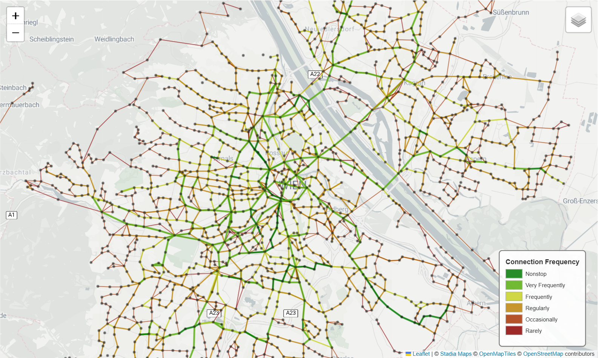
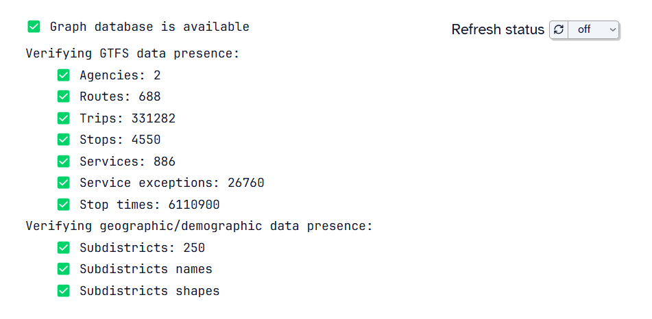

# Wiener Linien Knowledge Graph

_A machine learning project to uncover missing transit connections in Vienna’s public transport network._



This project builds a [knowledge graph (KG)](https://en.wikipedia.org/wiki/Knowledge_graph) of the Dec 2024 - Dec 2025 public
transport schedule of Wiener Linien GmbH & Co KG. It combines an open [GTFS schedule dataset](https://www.data.gv.at/katalog/datasets/ab4a73b6-1c2d-42e1-b4d9-049e04889cf0)
with [fine-grained population data](https://www.data.gv.at/katalog/datasets/09e70f89-cadf-4a3b-a29a-2b3f3c6cbd71) (2021) and [geographic shapes of registration districts](https://www.data.gv.at/katalog/datasets/e4079286-310c-435a-af2d-64604ba9ade5) (_“Zählbezirke”_)
to **reason about transport availability in relation to population density**.

Applying the machine learning technique of [**knowledge graph embeddings**](https://en.wikipedia.org/wiki/Knowledge_graph_embedding),
this KG is then used to predict **where new connections could strengthen the network** by suggesting an adequate mode of
transport (bus/tram/subway) and operation frequency between previously disconnected stops (see [link prediction](https://en.wikipedia.org/wiki/Link_prediction)).

## Technologies

All data is stored in a [Neo4j graph database](https://neo4j.com), providing a unified representation of the aggregated
data sources and derived knowledge. For exploration and experimentation, the project includes a [Marimo notebook](https://marimo.io)
(a modern alternative to Jupyter) that offers an interactive and user-friendly interface to work with the knowledge graph.

For the knowledge graph embeddings, two different embedding models were compared, namely **RotatE** and **ComplEx**.

The project deployment is orchestrated through [docker](https://www.docker.com). All components of the project provide a Dockerfile
to create a docker image of the respective component, and the whole system is reliably deployed via the given
**docker compose** file.

## Project Structure

The project consists of two subprojects:
- **KG Initializer** (`./initializer`)  
A rust script that initializes the knowledge graph, i.e., fills a local neo4j instance with the initial dataset
located in `./data`.</br></br>
- **Notebook App** `./notebook`  
Marimo webapp that guides the user through the creation and evolution of the knowledge graph and exploration
of its knowledge through interactive queries. The notebook also offers a graphical user interface to train KG
embedding models and visualize a model's predictions regarding public transport connections in Vienna.

## Deployment

First, make sure [docker](https://www.docker.com) is installed on your system and the docker engine is running.  
Deploy the Wiener Linien Knowledge Graph through docker compose:

```sh
docker compose up
```

This will create and start each component in a predetermined order. In particular, it will first fetch the latest
**neo4j** image and run it. As soon as the neo4j container is healthily running, the **KG Initializer** container is deployed.
This container automatically fills the neo4j graph database with all initial datasets, unless the respective data is
already present. After the Initializer has finished its job, the **Notebook App** is started.

As soon as the `notebook-app` container is up and running, visit [localhost:2718](https://localhost:2718) to view
the marimo webapp (Note that `0.0.0.0:2718` as per the console logs of the notebook-app container will _not_ work
on your system).  

Check the status of the knowledge graph at the top of the webapp to see if all parts of the
deployment succeeded:

